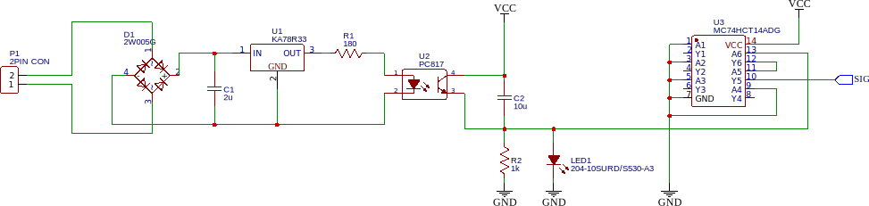

# wallbox
Project to adapt a 1950's era wall-box jukebox remote to control a Sonos / Google Music / MP3 player output.

## Control Circuit Schematic

## Block Diagram

Lots of help from the following:
* [www.smbaker.com/converting-a-seeburg-3wa-wallbox-into-a-remote-for-a-modern-music-player](http://www.smbaker.com/converting-a-seeburg-3wa-wallbox-into-a-remote-for-a-modern-music-player) 
* [www.retrofutureelectrics.com/seeburg-wall-o-matic/](https://www.retrofutureelectrics.com/seeburg-wall-o-matic/) 
